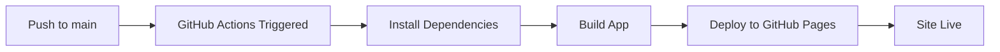

# GitHub Pages Deployment Guide

This guide explains how to deploy the Dorm Inspector modular application to GitHub Pages.

## 🚀 Quick Setup (Automatic Deployment)

### Prerequisites

- Your code is pushed to a GitHub repository
- You have GitHub Actions enabled

### One-Time Setup

#### Step 1: Enable GitHub Pages

1. Go to your repository on GitHub
2. Click **Settings** tab
3. Scroll to **Pages** section (left sidebar)
4. Under **Build and deployment**:
   - **Source**: Select "GitHub Actions"
   - Save the changes


#### Step 2: Update Repository Name in Config

If your repository is named something other than `claude-test`, update `vite.config.js`:

```javascript
// Change '/claude-test/' to match YOUR repository name
base: process.env.NODE_ENV === 'production' ? '/YOUR-REPO-NAME/' : '/',
```

For example, if your repo is `dorm-inspector`:
```javascript
base: process.env.NODE_ENV === 'production' ? '/dorm-inspector/' : '/',
```

#### Step 3: Push to Main Branch

```bash
# Make sure you're on the main branch
git checkout main

# Merge your work (if on a different branch)
git merge your-branch-name

# Push to GitHub
git push origin main
```

### 🎉 That's It!

GitHub Actions will automatically:
1. Build your app
2. Deploy to GitHub Pages
3. Your site will be live at: `https://YOUR-USERNAME.github.io/YOUR-REPO-NAME/`

### Monitoring Deployment

1. Go to your repository on GitHub
2. Click the **Actions** tab
3. You'll see the "Deploy to GitHub Pages" workflow running
4. Click on it to see the progress
5. Once complete, your site is live!

---

## 📋 Manual Deployment (Alternative)

If you prefer manual deployment or GitHub Actions isn't working:

### Step 1: Install gh-pages

```bash
npm install
```

(This installs the `gh-pages` package already added to `package.json`)

### Step 2: Deploy

```bash
npm run deploy
```

This will:
1. Build your app for production
2. Deploy to the `gh-pages` branch
3. Your site will be live in a few minutes

### Step 3: Configure GitHub Pages

1. Go to **Settings → Pages**
2. Under **Source**, select:
   - **Branch**: `gh-pages`
   - **Folder**: `/ (root)`
3. Click **Save**

Your site will be available at:
`https://YOUR-USERNAME.github.io/YOUR-REPO-NAME/`

---

## 🔧 Configuration Details

### Files Changed for GitHub Pages

1. **vite.config.js**
   - Added `base` path for GitHub Pages
   - Production environment detection

2. **.github/workflows/deploy.yml**
   - Automatic deployment workflow
   - Runs on push to main branch

3. **package.json**
   - Added `gh-pages` dependency
   - Added `deploy` script for manual deployment
   - Updated `build` script with NODE_ENV

4. **public/.nojekyll**
   - Empty file that tells GitHub Pages not to use Jekyll
   - Ensures files starting with `_` are served correctly

### Important Notes

#### Base Path

The `base` configuration in `vite.config.js` is crucial:

```javascript
base: process.env.NODE_ENV === 'production' ? '/YOUR-REPO-NAME/' : '/',
```

- **Development** (`npm run dev`): Uses `/` (root)
- **Production** (`npm run build`): Uses `/YOUR-REPO-NAME/`

This ensures:
- Assets load correctly on GitHub Pages
- Links work properly
- No 404 errors

#### Repository Name

Your site URL structure:
- **User/Organization Pages**: `https://username.github.io/`
  - Set `base: '/'`
- **Project Pages**: `https://username.github.io/repo-name/`
  - Set `base: '/repo-name/'`

---

## 🐛 Troubleshooting

### Issue: 404 Errors or Blank Page

**Cause**: Incorrect `base` path in `vite.config.js`

**Solution**:
1. Check your repository name
2. Update `base` to match: `base: '/YOUR-REPO-NAME/'`
3. Rebuild and redeploy

```bash
npm run build
npm run deploy
```

### Issue: Assets Not Loading (CSS/JS 404)

**Cause**: Missing `.nojekyll` file or incorrect base path

**Solution**:
1. Ensure `public/.nojekyll` exists (already created)
2. Verify `base` path in `vite.config.js`
3. Clear cache and rebuild:

```bash
rm -rf dist
npm run build
npm run deploy
```

### Issue: GitHub Actions Workflow Failing

**Cause**: GitHub Pages not enabled or incorrect permissions

**Solution**:
1. Go to **Settings → Pages**
2. Ensure **Source** is set to "GitHub Actions"
3. Check **Actions** tab for error details
4. Verify workflow permissions:
   - Go to **Settings → Actions → General**
   - Under **Workflow permissions**, enable:
     - "Read and write permissions"

### Issue: Firebase Not Working on GitHub Pages

**Cause**: Firebase configuration or CORS issues

**Solution**:
1. Verify Firebase config in `src/config/firebase.js`
2. Check Firebase console:
   - **Authentication → Settings → Authorized domains**
   - Add: `YOUR-USERNAME.github.io`
3. Check Firebase Security Rules allow your operations

### Issue: Changes Not Appearing

**Cause**: Browser cache or deployment not complete

**Solution**:
1. Hard refresh: `Ctrl+Shift+R` (Windows/Linux) or `Cmd+Shift+R` (Mac)
2. Check GitHub Actions to ensure deployment completed
3. Wait 1-2 minutes after deployment finishes
4. Clear browser cache completely

---

## 🔄 Deployment Workflow

### Automatic (GitHub Actions)



1. Push code to `main` branch
2. GitHub Actions automatically triggers
3. Builds your app with production settings
4. Deploys to GitHub Pages
5. Site updates in ~2 minutes

### Manual (gh-pages)

```bash
npm run deploy
```

1. Builds app locally
2. Pushes to `gh-pages` branch
3. GitHub Pages serves from that branch
4. Site updates in ~2 minutes

---

## 📊 Monitoring Your Site

### Check Deployment Status

1. **GitHub Actions**:
   - Go to **Actions** tab
   - View workflow runs
   - See build logs

2. **GitHub Pages**:
   - Go to **Settings → Pages**
   - See current deployment status
   - View live site link

### View Build Logs

If something goes wrong:
1. Click on the failed workflow in **Actions**
2. Click on the job that failed
3. Expand the step that had an error
4. Read the error message

---

## 🌐 Custom Domain (Optional)

To use a custom domain like `dorm-inspector.com`:

### Step 1: Add Custom Domain

1. Go to **Settings → Pages**
2. Under **Custom domain**, enter your domain
3. Click **Save**

### Step 2: Configure DNS

Add DNS records with your domain provider:

**For apex domain (example.com)**:
```
Type: A
Name: @
Value: 185.199.108.153
Value: 185.199.109.153
Value: 185.199.110.153
Value: 185.199.111.153
```

**For subdomain (www.example.com)**:
```
Type: CNAME
Name: www
Value: YOUR-USERNAME.github.io
```

### Step 3: Enable HTTPS

1. Wait 24 hours for DNS propagation
2. Go to **Settings → Pages**
3. Check "Enforce HTTPS"

---

## 📦 What Gets Deployed

The `dist/` folder contains:

```
dist/
├── assets/
│   ├── index-[hash].js      # Minified JavaScript
│   ├── index-[hash].css     # Minified CSS
│   └── ...                  # Other optimized assets
├── index.html               # Entry point
└── .nojekyll                # GitHub Pages config
```

- All JavaScript is bundled and minified
- CSS is extracted and optimized
- Assets have cache-busting hashes
- Tree-shaking removes unused code

---

## 🎯 Best Practices

### 1. Always Test Locally First

```bash
npm run build
npm run preview
```

Visit `http://localhost:4173` to test the production build locally.

### 2. Use Environment Variables for Secrets

Don't commit sensitive data. Use GitHub Secrets:

1. Go to **Settings → Secrets → Actions**
2. Add secrets (e.g., API keys)
3. Reference in workflow: `${{ secrets.SECRET_NAME }}`

### 3. Monitor Performance

Use Lighthouse in Chrome DevTools:
1. Open DevTools (F12)
2. Go to "Lighthouse" tab
3. Click "Analyze page load"

### 4. Keep Dependencies Updated

```bash
npm outdated          # Check for updates
npm update           # Update dependencies
npm audit            # Check for vulnerabilities
npm audit fix        # Fix vulnerabilities
```

---

## 📚 Additional Resources

- [GitHub Pages Documentation](https://docs.github.com/pages)
- [GitHub Actions Documentation](https://docs.github.com/actions)
- [Vite Deployment Guide](https://vitejs.dev/guide/static-deploy.html)
- [Custom Domains Guide](https://docs.github.com/pages/configuring-a-custom-domain-for-your-github-pages-site)

---

## 🆘 Getting Help

If you encounter issues:

1. **Check this guide** first
2. **Review GitHub Actions logs** for specific errors
3. **Check browser console** for client-side errors
4. **Verify Firebase configuration** if data isn't loading
5. **Clear cache** and try again

Common commands for debugging:

```bash
# Rebuild from scratch
rm -rf node_modules dist
npm install
npm run build

# Test production build locally
npm run preview

# Check for issues
npm run build -- --debug

# View detailed logs
git push origin main --verbose
```

---

## ✅ Deployment Checklist

Before deploying, ensure:

- [ ] Repository name matches `base` in `vite.config.js`
- [ ] GitHub Pages is enabled in repository settings
- [ ] Source is set to "GitHub Actions" (for automatic) or "gh-pages" (for manual)
- [ ] Firebase config is correct in `src/config/firebase.js`
- [ ] All changes are committed and pushed
- [ ] Build succeeds locally with `npm run build`
- [ ] Preview works with `npm run preview`
- [ ] `.nojekyll` file exists in `public/`

---

**Your app is now deployed! 🎉**

Visit: `https://YOUR-USERNAME.github.io/YOUR-REPO-NAME/`
